# PA 3: Tensor Parallel Communication and Training Cost Analysis

In this programming assignment, you will work on two tasks:

The first task is to develop communication protocols for Data Parallel and Tensor Model Parallel training from the ground up, utilizing the Message Passing Interface ([MPI](https://mpi4py.readthedocs.io/en/stable/)) and NumPy.

Since the main focus will not be on the actual forward computation or backward propagation, we have supplied template code that includes the forward and backward logic. Your task will be to implement only the communication aspects.

Your second task would be analyze the training cost of Llama-7B. You will be asked to estimate the number of model parameters and the amount of flops and memory required for training. In addition, you will also have the chance to design your optimal model training schema given a scaling law and compute budget.

**Note: we will only focus on the forward pass of the training loop for this PA.**

### Setup Guide

You'll need need a multi-core machine with at least 8 cores for this assignment.

#### Installing MPI
You'll need to have MPI installed for this assignment. 

##### Linux
```bash
sudo apt install libopenmpi-dev
```
##### MacOS
```bash
brew install openmpi
```
##### Windows
Go to the following and install mpiexec. Note, you'll have to use `mpiexec` instead of `mpirun` in all the commands in this assignment.
https://learn.microsoft.com/en-us/message-passing-interface/microsoft-mpi

#### Conda
The easiest way is to install an environment manager such as [Miniconda](https://docs.anaconda.com/free/miniconda/) and MPI for your OS (supported on MacOS, Linux, and Windows).

Once you have Conda installed and initialzied, create a new env with the following command:
```bash
conda create -n hw3 python=3.10 -y
```
Then activate it:
```bash
conda activate hw3
```
Now you should be able to install the requirements.txt
```bash
git clone 
cd 
pip install -r requirements.txt
```

**You can also create and activate Conda environments through VSCode.**


With your environment active you can clone the repo and install the dependencies:

```bash
git clone https://github.com/hao-ai-lab/dsc291-PA
cd pa3
pip install -r requirements.txt
```

Make sure your platform contains MPI support with at least 8 cores.

### Part 0. Warm-up

This assignment aims to guide you step by step through a 2D parallel training pipeline,incorporating both tensor model and data parallel training. For tensor model parallel training, we will delve into the naive approach. 

To become acquainted with our communication protocols, we will begin by experimenting with the MPI package that has been installed.

#### MPI Test
To verify that *mpi4py* has been setup correctly for distributed workloads, run:
```bash
mpirun -n 8 python mpi-test.py
```

Or if you are using Windows, use `mpiexec` instead of `mpirun` for all of follow commands:
```bash
mpiexec -n 8 python mpi-test.py
```

Depending on your machine, you can control the number of processes lanched with the `-n` argument. 


Additionally, we have included some simple examples of MPI functions in mpi-test.py, such as Allreduce(), Allgather(), Reduce_scatter(), and Split(). Please note that these four MPI functions are the only ones you need to use and are permitted for this assignment.
- ##### All-Reduce

<p align="center">
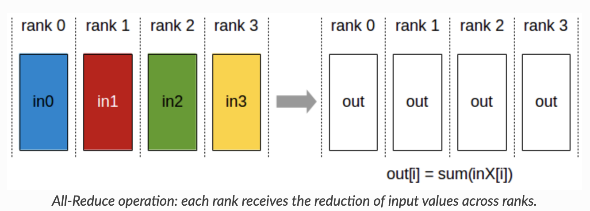
</p>

You can see an all-reduce example by running:
```bash
mpirun -n 8 python mpi-test.py --test_case allreduce
```

- ##### All-Gather

<p align="center">
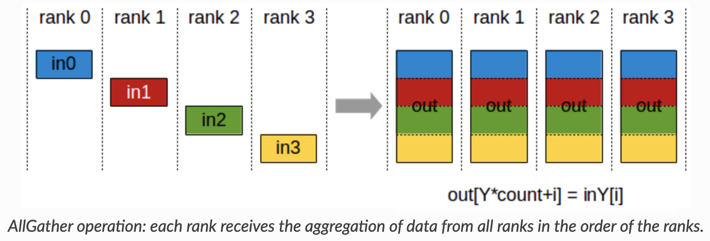
</p>

You can see an all-gather example by running:
```bash
mpirun -n 8 python mpi-test.py --test_case allgather
```

- ##### Reduce-Scatter

<p align="center">
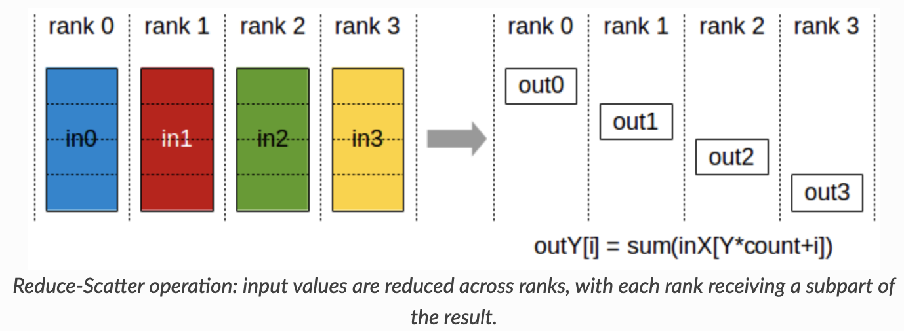
</p>

You can see a reduce-scatter example by running:
```bash
mpirun -n 8 python mpi-test.py --test_case reduce_scatter
```

- ##### Split

<p align="center">
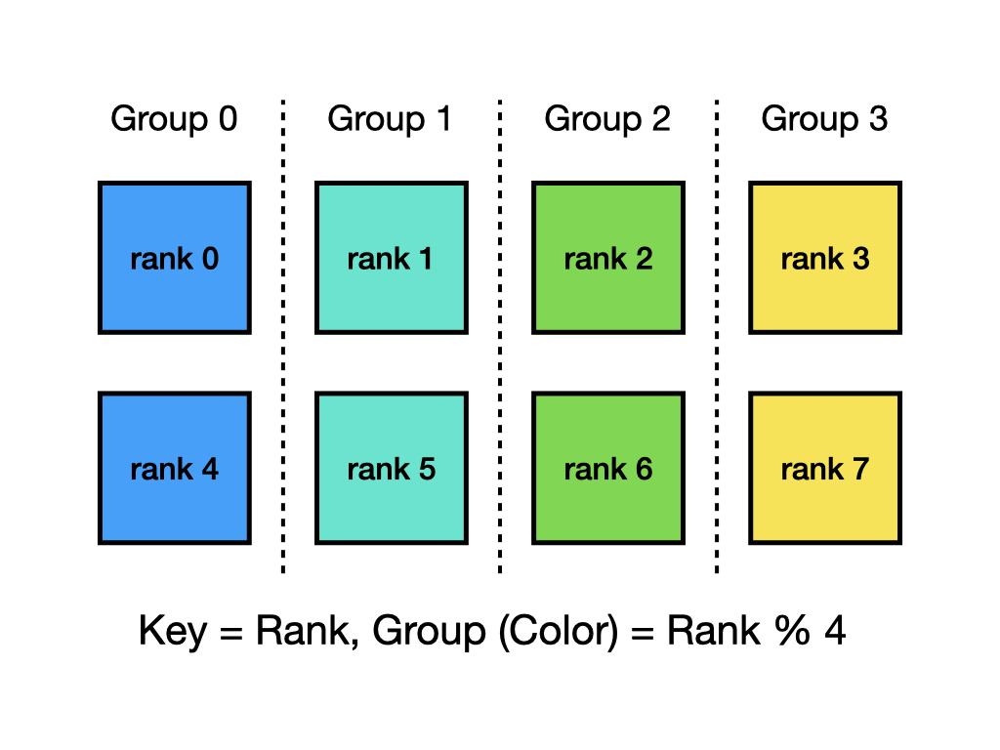
</p>


The Split function is particularly useful when applying MPI functions on a group basis. You can observe an example of group-wise reduction with the split function by running: 

```bash
mpirun -n 8 python mpi-test.py --test_case split
```

When playing with different test cases, try to get yourself familiar with the underline mpi functions 
and think about whether the output meets your expectation. 


#### Node Indexing Specifications

With a given data and model parallel size, we will assign nodes in a model parallel major for this assignment.
For instance, for `mp_size=2, dp_size=4` on 8 nodes we will group the nodes as shown below:

<p align="center">

</p>

### Part 1. Data Split for Data Parallel Training (10 pts)

For this part, your task is to implement the `split_train` function in `data/data_parallel_preprocess.py`.

The function takes in the training data and returns the data split according to the given `mp_size, dp_size` 
and `rank`. You should split data uniformly across data parallel groups while the model parallel groups can share the 
same data split within the same data parallel group. The data length is guaranteed to be divided equally by the
`dp_size` in all our test cases.

Hints: 
For `mp_size=2, dp_size=4`, you should split the data this way:
 
<p align="center">
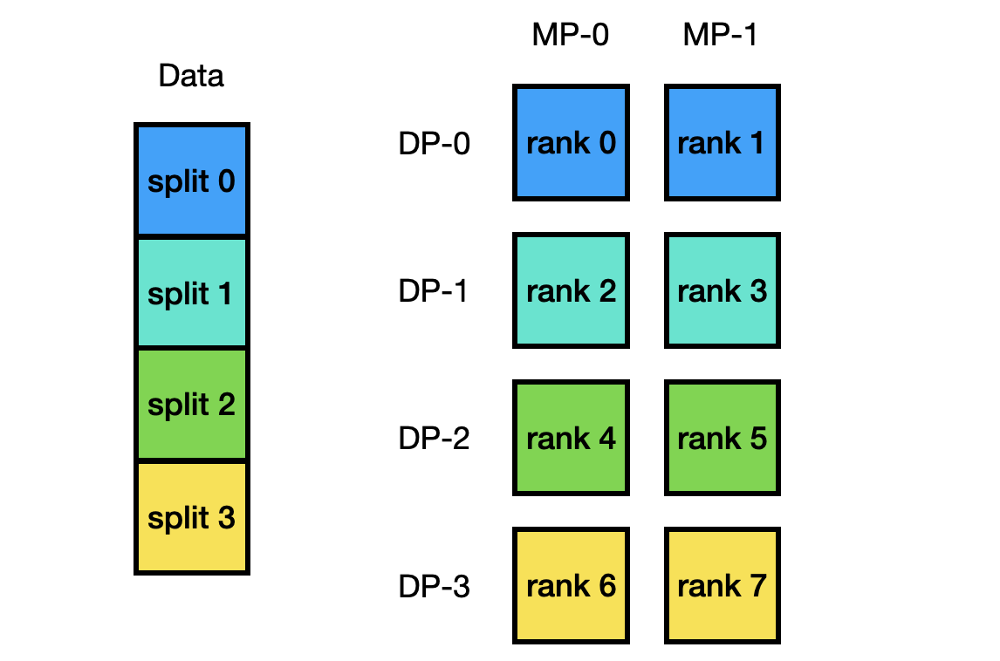
</p>

To test your implementation, please run
```bash
python3 -m pytest -l -v tests/test_data_split.py
```

### Part 2. Layer Initialization (20 pts)

In this part, your task is to get necessary information for model and data parallel training, which is then
used to initialize the corresponding layers in your model.

For this assignment we will work with a simple two layer perceptron model as shown below:

<p align="center">
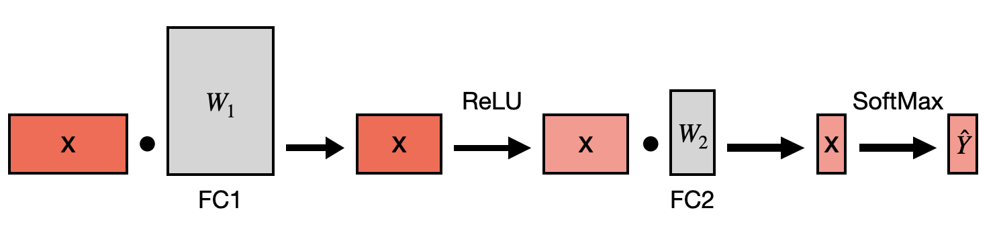
</p>

You are only required to implement the communications within two fully connective layers for forward and backward.
We have already taken care of the other stuffs i.e. the forward/backward computations and the training pipeline as these
are not relevant to the goal of this assignment.

For data parallel, we simply just split the batch of data equally across different data parallel groups:

<p align="center">
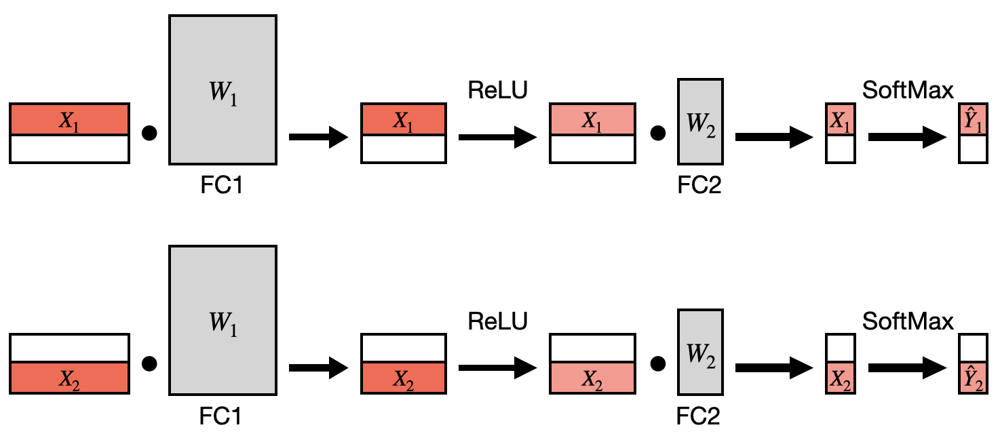
</p>

For naive tensor model parallel training, we split the weight matrix of both the fully connective layers (fc1, fc2)
along the output dimension (partition output) and shard them across different nodes. (Note that we don't shard different layers 
to different node as we don't consider pipeline parallelism here)

<p align="center">
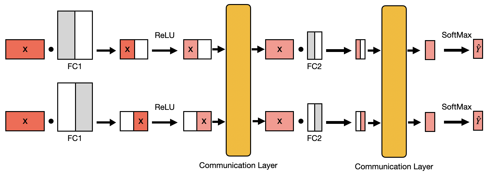
</p>

For Megatron-style tensor model parallel training, we split the weight matrix of FC1 across the output dimension (partition output) 
and the weight matrix of FC2 across the input dimension and shard them across different nodes (reduce output).

<p align="center">
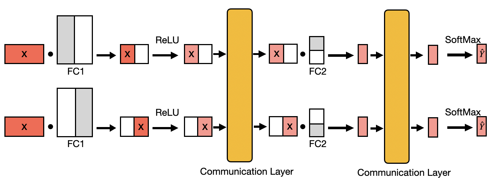
</p>

Given the above information, you need to implement the `get_info` function in `model/func_impl.py`.
The function gets essential information for later parts, including model/data parallel indexing,
model/data parallel communication groups, in/out dimensions for two FC layers. Please refers to the function
for more information and hints.

To test your implementation, please run
```bash
mpirun -n 8 python3 -m pytest -l -v --with-mpi tests/test_get_info.py
```

### Part 3. Naive Model Parallel Forward Communication (15 pts)

<p align="center">
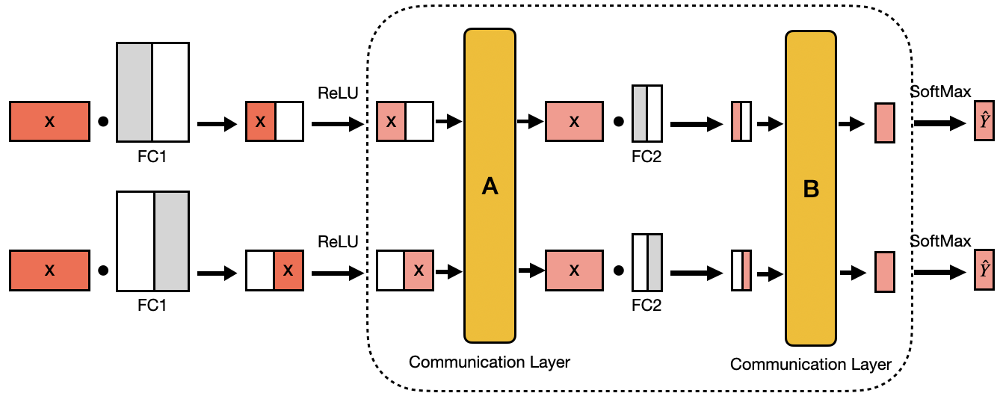
</p>

As communication only happens in the FC2 layer for the model we defined, your task
in this part is to implement the forward communications in FC2 for the naive model parallel.
You need to implement the `naive_collect_forward_input` and `naive_collect_forward_output` functions in
`model/func_impl.py`, which corresponds to the two communication layers (A, B) shown above.

To test your implementations, please run
```bash
mpirun -n 4 python3 -m pytest -l -v --with-mpi tests/test_naive_mp_forward.py
```

### Part 4. Model Training Cost Analysis (15 pts)
In the file `llama_7b_config.jon`, the model configurations of Llama-7B is provided. Your task is to implement the `model_training_cost_analysis` function in the `model_training_cost_analysis.py` file. This function takes the path to the Llama-7B model configuration file and outputs the number of trainable model parameters, number of TFLOPs and the peak memory cost required during training. 

The total model parameters should include:
* the parameters for word embedding
* the parameters for positional embedding
* the parameters for the transformer layers (Attention, MLP, and Layernorm)

The number of TFLOPs refers to the amount of computation required for the forward pass of a single transformer layer in the Llama-7B model. The peak memory cost is the amount of GPU memory required for the forward pass of a single transformer layer using fixed `fp16` precision training.

We will use the following command to check the output of your implementation:
```bash
python3 model_training_cost_analysis.py --model_config <path-to-llama_7b-config.json>
```

### Part 5. Design your own model trainig schema (15 pts)
In this part, you will be required to determine the optimal model size and the amount of training tokens given the following scaling law and a training budget of 1.23e+22 FLOPs.

<p align="center">
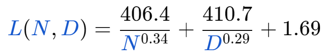
</p>

Please implement the `get_optimal_N_D` function in the file `model_training_cost_analysis.py`.
We will use the following command to check the output of your implementation:
```bash
python3 model_training_cost_analysis.py --training_budget <training_budget>
```


### How to Submit Your Homework (Important!)

In your homework3 root directory run
```bash
make handin.tar
```
Then you will see a `handin.tar` file under your root directory, please go to Gradescope and submit the tar.

The maximum total score for this assignment is 75 pts and we will use this score as your final score for PA 3. 


#### References 

- some images credit to https://docs.nvidia.com/deeplearning/nccl/user-guide/docs/usage/collectives.html
